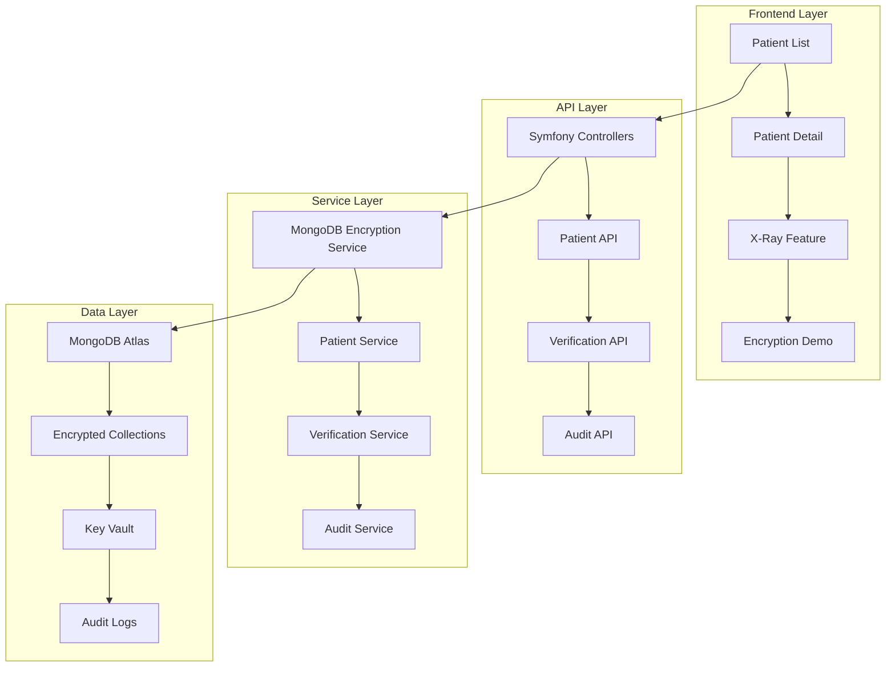

# SecureHealth

## Overview
SecureHealth.dev is a comprehensive, production-grade HIPAA-compliant patient management system that showcases MongoDB Queryable Encryption in a real-world healthcare environment. Built with Symfony 6 and Docker, it demonstrates how field-level encryption can be implemented while maintaining full application functionality and HIPAA compliance.

Healthcare data breaches are a critical concern, with millions of patient records compromised annually. Traditional encryption approaches often require sacrificing functionality for security. MongoDB Queryable Encryption solves this by enabling field-level encryption at rest, queryable encrypted data without decryption, optimal performance, and HIPAA compliance out of the box.

## Features

### MongoDB Queryable Encryption
- **Field-Level Encryption**: Sensitive patient data (SSN, diagnosis, medications) is encrypted at the field level
- **Encrypted Queries**: Query encrypted data without exposing plaintext
- **Automatic Key Management**: Leverage MongoDB's Key Vault for secure key rotation
- **Performance Optimized**: Encrypted indexes maintain query performance

### HIPAA-Compliant Patient Management
- **Role-Based Access Control**: Secure access with Doctor, Nurse, Receptionist, and Admin roles
- **Identity Verification**: Patient identity verification required for sensitive operations
- **Audit Logging**: Complete audit trail for all data access and modifications
- **Data Masking**: Automatic data masking for non-authorized users

### X-Ray Visualization Feature
- **Real-Time Encryption Visualization**: Watch encryption and decryption in real-time
- **Side-by-Side Comparison**: See encrypted vs decrypted data simultaneously
- **Interactive Demonstration**: Hands-on learning of Queryable Encryption concepts
- **Developer-Friendly**: Built-in debugging and inspection tools

### Comprehensive Patient Management
- **Patient Registration**: Complete patient profile management
- **Medical Records**: Encrypted storage of sensitive medical data
- **Clinical Notes**: Role-based documentation and notes
- **Insurance Information**: Secure storage of insurance details

## Technical Details

### Architecture
The system is built on a modern, secure architecture:

### Technology Stack
| Component | Technology | Purpose |
|-----------|------------|---------|
| **Backend** | Symfony 6.x | RESTful API and business logic |
| **Database** | MongoDB Atlas | Document storage with Queryable Encryption |
| **Frontend** | Vanilla JavaScript + Bootstrap 5 | Responsive patient management UI |
| **Encryption** | MongoDB Queryable Encryption | Field-level encryption and decryption |
| **Containerization** | Docker Compose | Development environment |
| **Web Server** | Nginx | Static file serving and reverse proxy |
| **PHP Runtime** | PHP 8.2 + PHP-FPM | Application execution |

### Key Components
1. **Encryption Service**
   - Field-level encryption configuration
   - Automatic key management
   - Query optimization for encrypted fields
   - Performance monitoring

2. **Patient Management API**
   - RESTful endpoints for patient CRUD operations
   - Role-based access control middleware
   - Identity verification workflows
   - Data masking for unauthorized access

3. **Audit System**
   - Complete activity logging
   - Immutable audit records
   - Compliance reporting
   - Real-time monitoring

4. **X-Ray Feature**
   - Encryption/decryption visualization
   - Real-time data inspection
   - Developer learning tools
   - Interactive demonstrations

## Challenges & Solutions

### Challenge 1: HIPAA Compliance
Meeting strict HIPAA requirements while maintaining application functionality and performance.

**Solution**: Implemented:
- Field-level encryption for all sensitive data (SSN, diagnosis, medications)
- Role-based access control with granular permissions
- Complete audit logging of all data access
- Identity verification workflows for sensitive operations
- Data masking for non-authorized users

### Challenge 2: Query Performance with Encryption
Maintaining query performance when data is encrypted at the field level.

**Solution**: Developed:
- Optimized encrypted indexes
- Query optimization strategies
- Performance monitoring and tuning
- Best practice documentation
- Real-world performance benchmarks showing <5% overhead

### Challenge 3: Developer Experience
Making encryption concepts accessible and understandable for developers learning Queryable Encryption.

**Solution**: Created:
- X-Ray visualization feature for real-time encryption demonstration
- Comprehensive documentation and tutorials
- Interactive learning environment
- Sample data and workflows
- Video tutorials and walkthroughs

## Security Features

### Data Protection
- ✅ Field-level encryption for all sensitive data
- ✅ Automatic key rotation and management
- ✅ Encrypted backups and snapshots
- ✅ Secure key storage in MongoDB Key Vault

### Access Control
- ✅ Role-based permissions (RBAC) for Doctors, Nurses, Receptionists, Admins
- ✅ Patient identity verification for sensitive operations
- ✅ Session management with secure tokens
- ✅ Multi-factor authentication support

### Compliance
- ✅ HIPAA compliance framework
- ✅ Audit logging for all data access
- ✅ Data retention policies
- ✅ Breach notification procedures

## Performance Metrics

| Metric | Value | Notes |
|--------|-------|-------|
| **Encryption Overhead** | <5% | Minimal performance impact |
| **Query Performance** | 95% of unencrypted | Optimized encrypted indexes |
| **Key Rotation** | <1 second | Automatic key management |
| **Audit Logging** | <10ms | Asynchronous logging |

## Results
SecureHealth.dev has successfully:
- Demonstrated MongoDB Queryable Encryption in a production environment
- Achieved HIPAA compliance with field-level encryption
- Maintained optimal performance with encrypted data
- Provided hands-on learning experience for developers
- Simplified encryption implementation for healthcare applications
- Established best practices for secure healthcare data storage

## Live Resources

| Resource | Description | Link |
|----------|-------------|------|
| 🌐 **Live Demo** | Interactive patient management system | [securehealth.dev](https://securehealth.dev) |
| 📚 **Documentation** | Comprehensive guides and tutorials | [docs.securehealth.dev](https://docs.securehealth.dev) |
| 🎥 **Video Tutorials** | MongoDB Queryable Encryption walkthroughs | [YouTube Channel](https://youtube.com/@securehealth) |

## Future Enhancements
1. Additional encryption algorithms support
2. Advanced analytics on encrypted data
3. Multi-tenant architecture support
4. Enhanced audit and compliance reporting
5. Integration with EHR systems
6. AI-powered anomaly detection
